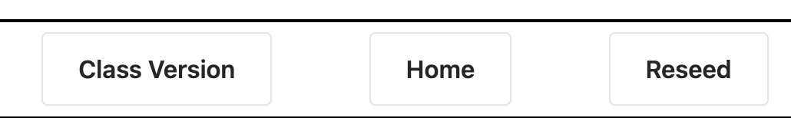

# Pup-E-Picker

In this assignment we will be building a dog-favoriting app called Pup- E-Picker. This app will allow users to...

- add dogs to a list of favorites
- remove dogs from the list of favorites
- create new dogs for the system
- delete dogs from the system

## Learning Objectives

In order to complete this assignment, a student should be able to...

- use array states to store data from a server
- make `GET` requests to a server to retrieve data
- make `POST` requests to a server to create data
- make `DELETE` requests to a server to delete data
- make `PATCH` requests to a server to update data
- use `onSubmit` handlers to make form submissions
- using helper functions to clean up your fetch calls
- pass down state setters in order to change the state of a parent component
- set up application state correctly
- use loading states to prevent errors and make user experience better
- use `useEffect` to trigger code when a component mounts in a functional component
- use `componentDidMount` to trigger code when a component mounts in a class component
- use a controlled form to submit data to the server
- use `children` to create a Layout Component
- use `react-hot-toast` to create toast notifications

## Setup

To get this project setup, you should:

- Run `npm i` to install all dependencies
- Run `npm run dev` to run the project
- Run `npm run serve` to run the server
- Run `npm run seed` to seed the server
- Run `npm run serve:slow` to run the server with a delay on all requests
  - This is useful for testing loading states

## Standard Requirements

- [ ] Setup eslint
- [ ] Pass all linting checks

- To check if linting passes, run `npm run lint`

- [ ] Format code with prettier
- [ ] State should not be duplicated
- [ ] Variables should be named logically
- [ ] No unnecessary console logs
- [ ] No commented out blocks of code (Code comments are fine)
- [ ] Setup a github repository with your submission as the `main` branch, you will submit a link to this for grading (NOT A ZIP FILE)

## Typescript Specific Requirements

- [ ] pass **ALL** type checks
  - Check by running `npm run typecheck`
- [ ] DON'T USE `any`.... OR ELSE
- [ ] Keep your types clean and in a logical location
- [ ] Prop Types for components should be collocated with their components
- [ ] Shared types should live in a file that says `types` somewhere in it's name
  - [ ] example: `types.ts` should work fine
- [ ] Unshared types should live in the component they are used in

## Example Of Correct Code

You can play around with the correct deployed version of this code using [This Deployed Version of The App](https://pup-e-picker-live-frontend.vercel.app/)

Note: It's not a perfect mapping to what you're going to build, below highlights the difference between the deployed version and what you are going to build.

- The deployed version has three buttons in the Section components that you won't have to worry about, we will leave in the something similar that should allow you to easily switch between working on your class app and your functional app.

- The deployed version has a reseed command that you will not have to worry about
  - It was necessary so that way everyone viewing it could own their own data, but you will not need to worry about this

## Showing the Correct Component

- [ ] place `FunctionalDogs` inside of the `.content-container` div of the `FunctionalSection` component **using React Children**
- [ ] place `FunctionalCreateDogForm` inside of the `.content-container` div of the `FunctionalSection` component **using React Children**
- [ ] place `ClassDogs` inside of the `.content-container` div of the `ClassSection` component **using React Children**
- [ ] place `ClassCreateDogForm` inside of the `.content-container` div of the `ClassSection` component **using React Children**

## Navigation

You should use conditional rendering to show different components inside of the `(Class | Functional)Section` components using react children. The specifications are as follows...

### when no tab is active

- [ ] show the `(Functional | Class)Dogs` component
- [ ] the dogs we can see should be ALL OF THE DOGS FETCHED

### when the `favorited` tab is active

- [ ] shows the `(Functional | Class)Dogs` component
- [ ] the dogs we can see should be ONLY THE DOGS WHERE `isFavorite` IS TRUE

### when the `unfavorited` tab is active

- [ ] should show the `Dogs` component
- [ ] the selected dogs should be ONLY THE DOGS WHERE `isFavorite` IS FALSE

### when the create dog tab is active

- [ ] should show the `Dogs` component
- [ ] the selected dogs should be ONLY THE DOGS WHERE `isFavorite` IS FALSE

### Tabs

- [ ] Should be black when active (You can add the `active` class to it to style an active tab correctly)
- [ ] Should be white when inactive
- [ ] Only zero - one tab should be active at a time
- [ ] Clicking on a tab should make it active and make all other tabs inactive
- [ ] Clicking an Active Tab should make it inactive

## Interacting With the API

- [ ] When the component loads, you should fetch all of the dogs from the server and store them in state
- [ ] When you click on a gray heart, it should turn red and the dog's `isFavorite` property should be set to `true` in the database
- [ ] When you click on a red heart, it should turn gray and the dog's `isFavorite` property should be set to `false` in the database
- [ ] When you click on the trash icon, it should delete the dog from the database and show the updated list of dogs
- [ ] When you create a dog, it should be added to the database

## Organizing your fetch calls

- [ ] You should have a file called `api.ts` with a request object that contains all of your fetching functions
- [ ] These can and should be shared to both your class components and your functional components as needed
- [ ] `getAllDogs` should return a promise that resolves to an array of all the dogs in the database
- [ ] `postDog` should take in a partial dog object, and return a promise that resolves to the dog object that was created
  - Note: Don't provide an id with the body of your request, the server will create an id for you
- [ ] `updateDog` should take in a partial dog object, and return a promise that resolves to the dog object that was modified
- [ ] `delete` should take in a number, delete the dog with that id, and return a promise

- We STRONGLY recommend you TEST these functions before you stress out about actually using them
- For example, MAKE SURE `getAllDogs` works before trying to use it in your components to render things on the page
- To do this, you can visit `/playground` in your browser and write some code in the `messAround` function located in the `Playground.tsx` file. To trigger your code, just press the button.

## Interacting With Fetch Calls

- [ ] When the component loads, you should fetch all of the dogs from the server and store them in state
- [ ] That state should be used to render all the appropriate `DogCards` on the page
- [ ] Dogs where isFavorite is true should have a red heart
- [ ] Dogs where isFavorite is false should have a gray heart
- [ ] Clicking a gray heart on a dog should turn it red and update the database to set `isFavorite` to `true`
- [ ] Clicking a red heart on a dog should turn it gray and update the database to set `isFavorite` to `false`
- [ ] Clicking the trash icon on a dog should delete it from the database and update the list of dogs on the page
- [ ] Creating a dog should add it to the database and update the list of dogs on the page

## Loading States

If the data is still loading then...

- [ ] All inputs should be disabled
- [ ] Buttons should be disabled

## What happens when you submit the form

- [ ] When you submit the form, it should create a new dog in the database
- [ ] If you navigate to the `all` tab, you should see the new dog in the list of dogs
- [ ] If you navigate to the `favorited` tab, you should NOT see the new dog in the list of dogs
- [ ] If you navigate to the `unfavorited` tab, you should see the new dog in the list of dogs
- [ ] After the submission the form should be cleared, and the select should return to the default
- [ ] After submitting a toast notification from `react-hot-toast` should appear saying "Dog Created"
